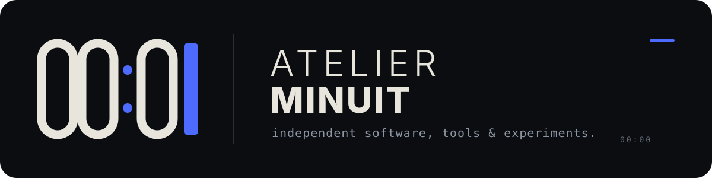

  

  <strong>Independent software, tools & experiments.</strong> 
  Small, local-first tools for macOS, Unix systems, hardware interoperability and automation.

---

## Selected work

### [TankControl](https://github.com/giorgiogpt/TankControl)

Native macOS tooling for the HP Smart Tank 500 series and the first public Atelier Minuit project.

**Current public release:** [v1.1.0](https://github.com/giorgiogpt/TankControl/releases/tag/v1.1.0) · MIT licensed  
**Distribution note:** the current PKG is unsigned and not notarized; the release documents this explicitly.

## Atelier scope

`macOS` · `Unix` · `Apple Silicon` · `Systems` · `Hardware` · `Automation` · `Local-first software`

## Principles

- **Useful over ornamental** — solve a concrete problem before adding surface area.
- **Local-first** — prefer local execution and user control when technically appropriate.
- **Verifiable engineering** — document tested behavior, limitations and architecture.
- **Small surface area** — fewer dependencies, fewer moving parts, clearer maintenance.

---

  <strong>ATELIER MINUIT</strong> · 00:00 · independent software atelier

